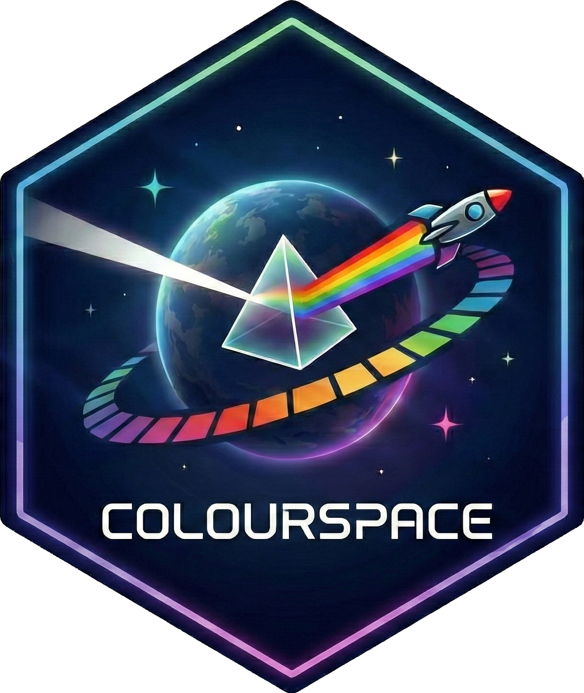

# colourspace 

*Technically speaking, we're dealing with color systems, not spaces. But since this is a hex-driven project, I couldn't pass up such a great name. 🚀*

## Main Functionality
Convert colours between spaces (hex, RGB, HSL, OKLab, OKLch) and generate modern ready-to-paste CSS syntax.

## Installation

``` r
# install.packages("pak")
pak::pak("iamyannc/colourspace")
```

## Who is this for?

Anyone doing awesome Shiny apps or Quarto dashboards that wants to spice things up with better colors, or any UI/UX/Web professional that wants to convert from one colour space to another,
or produce a modern CSS syntax programatically for any color out there. 🎨 

## Quick examples

``` r
library(colourspace)

# Convert hex to RGB
hex_to_rgb("#ff5733")
#>   r   g   b 
#> 255  87  51

# Get modern CSS output (oklch is the default)
to_css("#ff5733")
#> [1] "oklch(67.267% 0.208 37.377 / 1)"

# With transparency
to_css(c("coral", "teal"), alpha = 0.8)
#> [1] "oklch(72.556% 0.159 40.856 / 0.8)" "oklch(54.305% 0.098 194.764 / 0.8)"

# Reverse lookup: hex to colour name
hex_to_name("#c93f38")
#> [1] "100 Mph"

# Fallback to nearest named colour (default behaviour)
hex_to_name("#a1b2c3")
#> Warning: Fallback to nearest lab name for 1 colour(s).
#> [1] "Cadet Grey"

# Disable fallback to get NA for unknown colours
hex_to_name("#a1b2c3", fallback = FALSE)
#> [1] NA

# Low level function (great usecase for applying different spaces!)
convert_colourspace(value = "f", from = "hex", to = "name")
[1] "White"
```

## Colour spaces

| Space   | Description                                  |
|---------|----------------------------------------------|
| `hex`   | `#rrggbb` or `#rrggbbaa`                     |
| `rgb`   | Red, Green, Blue (0–255)                     |
| `hsl`   | Hue (0–360), Saturation, Lightness (0–100)   |
| `oklab` | Perceptually uniform Lab (L: 0–1, a/b: ±0.4) |
| `oklch` | Polar OKLab (L: 0–1, Chroma ≥0, Hue: 0–360)  |
| `name`  | Colour name from 31k+ database               |


## License
USE IT AS YOU PLEASE ♥️ 

- This package was inspired by [Antti Rask's col2hex2col](https://github.com/AnttiRask/col2hex2col).
- All the heavy lifting of matching color names to hex codes was handled by [David Aerne](https://github.com/meodai) in the [meodai/color-names](https://github.com/meodai/color-names) project.

